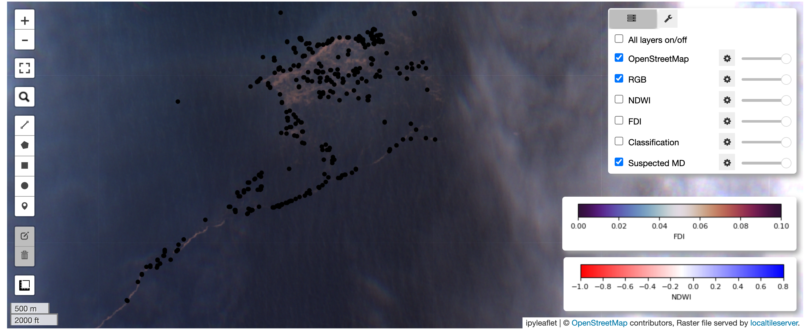

# JuliaEO - Global Workshop on Earth Observation with Julia 2024

# Session: 
# POS2IDON: Pipeline for Ocean Features Detection with Sentinel-2

Emanuel Castanho and Andrea Giusti (AIR Centre)

11 JANUARY 2024

### Preview:

### Setup on Docker (recommended):
1- Download Docker based on your operating system [here](https://www.docker.com/get-started/);

2- After installation using the recommended settings, start Docker without signing in and fill some information;

3- Download *AIRCentre/JuliaEO24* repository, click on *<> Code* and select *Download ZIP*;

4- Unzip the downloaded file and move the *JuliaEO24-main* folder to your Desktop or other path (keep the path simple);

5- Open a terminal (powershell on Windows) inside the folder *JuliaEO24-main/notebooks/pos2idon\_results\_demo*, copy and run the following commands: 

`docker build -t pos2idon_results_demo .` (wait until it finishes the building)

`docker run -it -p 8888:8888 -v .:/home/jovyan/pos2idon_results_demo pos2idon_results_demo` (do this on the same terminal/powershell, do not change this command)

Note: If the previous command gives an error on Windows, try: `docker run -it -p 8888:8888 -v ${PWD}:/home/jovyan/pos2idon_results_demo pos2idon_results_demo`

6- The previous command will start Jupyter, open the server url (try the third url) on your browser; 

7- Download *data.zip* from [here](https://drive.google.com/file/d/19_MfERFOdDpek5XjWR3dKQKPFWMsX520/view?usp=share_link), unzip it and replace *data* folder inside *pos2idon\_results\_demo*;

8- You are ready to run the notebook *pos2idon\_results\_demo.ipynb*

### Setup on Conda (optional):
5- If you do not want to use Docker, try Miniconda. After step 4, open a terminal/powershell inside the folder *JuliaEO24-main/notebooks/pos2idon\_results\_demo* and run the following commands:

`conda create -n pos2idon_results_demo-env python=3.9`

`conda activate pos2idon_results_demo-env`

`conda install -c conda-forge gdal=3.7.2`

`pip install notebook==7.0.6 localtileserver==0.7.2 geopandas==0.14.0 leafmap==0.27.0 scikit-learn==1.1.1 pyarrow==13.0.0`

6- On the same terminal/powershell, run `jupyter notebook` to start.

